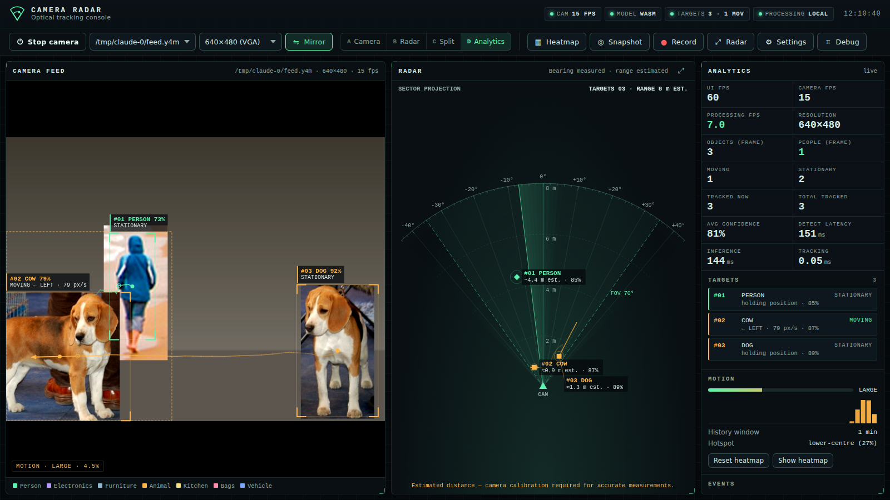
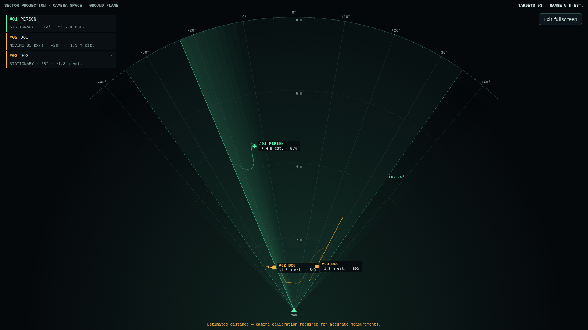

# Camera Radar

A browser-based computer-vision console. It turns a webcam or USB camera into a tracking system: live object detection, multi-target tracking, motion analysis, a motion heatmap, and a radar view driven by real camera data.

All processing runs **locally in the browser tab**. No frames are uploaded.



## Quick start

```bash
cd camera-radar
npm install
npm run fetch-model        # optional: copies the detection model into public/models for offline/same-origin use
npm run dev                # http://localhost:5173
```

Open the page, press **Start camera**, and allow camera access. `localhost` counts as a secure context. If you deploy the app anywhere else, serve it over HTTPS, because browsers only allow camera access in secure contexts.

`npm run build` writes a static site to `dist/`, which any static host can serve.

## What it does

| Area | Implementation |
|---|---|
| Camera | `getUserMedia` with device enumeration and selection (built-in or USB). Resolutions are filtered by the camera's reported capabilities. Mirror toggle. Detects disconnects (`track.ended`) and reconnects automatically on `devicechange`. Real FPS is measured with `requestVideoFrameCallback`. |
| Detection | TensorFlow.js COCO-SSD (80 classes: people, phones, laptops, chairs, tables, bottles, bags, animals and more) runs in a **Web Worker**. Backend order is WebGL → WASM → CPU, and software-emulated WebGL is detected and skipped. If workers are unavailable it falls back to the main thread. You can choose from 3 models. |
| Tracking | SORT-style tracker: Hungarian assignment on IoU + centre distance, a per-target alpha–beta filter, coasting through short dropouts, re-identification of targets that come back, and label voting so class flicker doesn't split IDs. |
| Movement | Direction (8-point compass), speed in **image px/s**, moving/stationary with hysteresis, sudden-movement detection, entry and exit edges, trails, previous and current positions, and velocity vectors. |
| Motion layer | Frame differencing on a 160-px grayscale copy, connected-component regions, small/large/sudden/whole-scene classification, enter/leave events, and adjustable sensitivity. |
| Heatmap | Sliding-window accumulator (10 s – 10 min) with a recent-motion highlight, hotspot zone, history sparkline, and a reset button. |
| Radar | Sector display with the camera at the apex. **Bearing** comes from the pinhole model and the configured FOV. **Range is an estimate** and is labelled that way everywhere. |
| Modes | A camera · B radar · C split · D split + analytics (keys 1–4). Switching is instant. |
| Analytics | UI/camera/processing FPS, resolution, objects, people, moving/stationary, tracked now and total, average confidence, detection latency, inference time, and tracking time. |
| Capture | Recording through `MediaRecorder`, with or without overlays, plus a visible REC indicator. Snapshots come with an optional overlay. Nothing is saved until you click Save. |
| Target panel | Click a target in the camera view, on the radar, or in the list to see live details, movement history, and events. The history can be exported as JSON. |
| Debug panel | Stream, model, backend, latency, tensor memory, JS heap, skipped frames, and the error/warning log. |
| Settings | Every option from the brief. Preferences persist in `localStorage`; nothing else is stored. |

Keyboard shortcuts: `1–4` modes · `H` heatmap · `S` snapshot · `R` record · `F` fullscreen radar · `D` debug · `Esc` close.



## Honest limitations

- **Distance cannot be measured with one webcam.** The radar range is estimated from each box's apparent size and a typical real-world size for the class (for example, a person is about 1.7 m tall). It is marked `est.` and carries the notice *"Estimated distance — camera calibration required for accurate measurements."* Estimates for partially visible objects are marked `≈` (rough). A depth camera removes the estimate (see Extensions).
- **Speed is image-plane pixels per second**, not km/h.
- **Bearing depends on the FOV setting.** Enter your camera's horizontal field of view in Settings → Radar. Typical laptop cameras are 60–78°.
- COCO-SSD sometimes confuses similar classes (dog and cow, for example). The tracker's label voting keeps the ID stable while this happens.
- Processing speed depends on hardware. Measured on a GPU-less VM (WASM backend): about 6 detections per second at ~150 ms inference, with the UI holding 60 FPS. A real GPU (WebGL) is normally several times faster, but that was not measured here. Adaptive performance lowers the detector load if the UI frame rate drops.

## Privacy

- Frames are processed only in this tab, with TensorFlow.js and canvas. The **PROCESSING · LOCAL** status chip reflects this.
- The only network request the app makes is the one-time model download. That comes from `public/models` (same origin), or from Google's public TF.js bucket if you have not run `npm run fetch-model`.
- Recording and snapshots start only when you click them. Results stay in memory until you save them.

## Architecture

```
src/
  camera/      CameraManager (FrameSource), device / resolution / disconnect handling
  detection/   DetectorClient (worker proxy + fallback), detector.worker, cocoSsdEngine, categories
  tracking/    Tracker (association, filtering, events), hungarian
  motion/      analysis (pure functions), MotionDetector, MotionHeatmap
  radar/       projection (camera → ground plane), RadarRenderer
  analytics/   Analytics (measured metrics only)
  recording/   Recorder (MediaRecorder), snapshot helpers
  ui/          OverlayRenderer, panels (analytics, target, settings, debug), toasts
  settings/    SettingsStore (typed, persisted preferences)
  utils/       emitter, logger, math, FPS meter, formatting
  extensions/  capability interfaces + registry for future hardware and models
  app.ts       pipeline orchestration (rAF render loop, throttled detection & motion)
```

Performance measures:

- Inference runs in a worker, and frames are downscaled with `createImageBitmap` and transferred without copying.
- Detection is throttled and skipped while a detection is already in flight.
- Motion analysis runs on a 160-px copy at about 15 Hz.
- Tracks are interpolated between detections at display rate.
- Panels that aren't visible are not rendered, and DOM updates are throttled to 4 Hz.
- Processing pauses while the tab is hidden.

## Extensions (future hardware and models)

`src/extensions/capabilities.ts` defines the contracts a later module implements:

- `DepthProvider`: depth or stereo cameras. When one is registered, the radar uses measured depth instead of the estimate. This is already wired in.
- `VisionModule`: pose, hands, gestures, segmentation, or another detector. Results attach to `track.meta`.
- `SpatialMapper`: room or spatial mapping and 3D radar.
- `FrameSource` (in `camera/types.ts`): other capture sources, such as multiple cameras or RGB-D.

No fake versions of these are included.

## Tests

```bash
npm run test:unit      # tracker, Hungarian, projection, motion analysis, heatmap (node --test)

# End-to-end in headless Chromium with a fake camera fed by real photos:
python3 -m pip install pillow
curl -LO https://raw.githubusercontent.com/tensorflow/tfjs-models/master/coco-ssd/demo/image1.jpg
curl -LO https://raw.githubusercontent.com/tensorflow/tfjs-models/master/coco-ssd/demo/image2.jpg
python3 tests/e2e/make-feed.py image1.jpg image2.jpg tests/e2e/feed.y4m
npm run test:e2e       # 56 checks, screenshots + report in test-results/
```

The e2e suite covers:

- camera permission, selection, live video, and stream stop
- detection, multiple targets, movement and sudden movement, and stable IDs
- radar staying in sync with tracks, and enter/exit events
- overlay toggles, heatmap and reset, modes, and settings including theme
- recording, snapshots, fullscreen radar, and the debug panel
- disconnect and automatic reconnect
- four responsive viewports
- no external network traffic
- failure paths: model download failure, a real permission denial, no camera, and an unsupported browser
